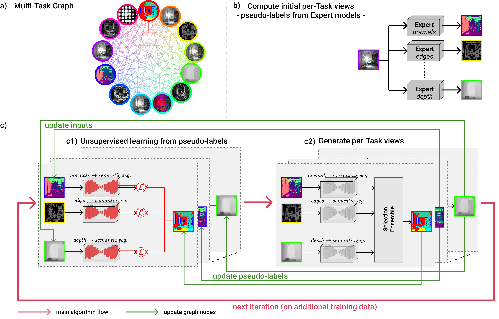

# CShift 
This repository contains the PyTorch implementation of the CShift model introduced in our paper:
* **Paper**: [Self-Supervised Learning in Multi-Task Graphs through Iterative Consensus Shift](https://arxiv.org/pdf/2103.14417.pdf) 
* **Authors**: Emanuela Haller*, Elena Burceanu* and Marius Leordeanu (*equal contribution)
* **Venue**: BMVC 2021

<div align="center">
  
</div>


## Overview 
We provide code for reproducing the main results in our paper on 2 datasets (Replica and Hypersim). Our self-supervised approach exploits the consensus in a multi-task graph to adapt to newly seen data distributions.  As a starting point, we use off-the-shelf expert models trained out of distribution for various visual tasks (we provide code for 13 such experts). The graph will self-adapt to the target distribution, overcoming the performance of the initial experts.

## Installation 
Create a conda environment with the following configuration (it includes dependencies for all the experts):
* ```conda env create -f environment_chift.yml```

# CShift steps
## Step 0. Download expert models
`cd experts/models; bash get_models.sh` 

## Step 1. Preprocess
We provide code for preprocessing 13 experts, on 2 datasets: Replica and Hypersim. 
### Replica
Generate and preprocess the Replica dataset:
* download metadata from [Replica repo](https://github.com/facebookresearch/Replica-Dataset), see `preprocess_dbs/replica_generator/generator.py` from our repo
* `cd preprocess_dbs/replica_generator; python generator.py`
* ```cd preprocess_dbs; bash preprocess_replica.sh```
* **note**: you need to update paths in both `preprocess_dbs/replica_generator/generator.py` and `preprocess_dbs/main_replica.py`

### Hypersim
Generate and preprocess the Hypersim dataset:
* download dataset from [Hypersim repo](https://github.com/apple/ml-hypersim), see `preprocess_dbs/hypersim/dataset_download_images.py` from our repo 
* our dataset splits are available in `preprocess_dbs/hypersim/cshift_hypersim_splits.csv`
* `cd preprocess_dbs; bash preprocess_hypersim.sh`
* **note**: you need to update paths in `preprocess_dbs/main_hypersim.py`

## Step 2. Train
Once we have the datasets generated and preprocessed, we train each edge based on the current iteration pseudo-labels. Each line in the following script trains trains all graph's edges that reach a certain node (eg. depth_xtc)
* ```bash script_train_all.sh```
* **note**: you need to update [PathsIter] and [Edge Models] load_path from the configuration file with your own paths. 

## Step 3. Eval [optional]
The following script evaluates each edge and the CShift selection based ensemble. 
* ```bash script_eval_all.sh```
* **note**: you need to update  [PathsIter] and [Edge Models] load_path from the configuration file with your own paths. 

## Step 4. Store
For storing the current CShift predictions (for using them further as pseudo-labels in the next iteration):
* ```bash script_store_all.sh```
* **note**: you need to update  [PathsIter] and [Edge Models] load_path from the configuration file with your own paths. 

## Step 5: Goto Step 2. Train
For adding a new iteration, repeat training + store steps, using as pseudo-labels the outputs saved in the previous iteration, in Step 4. Store.

## Expert Models
<!-- | TODO - remove this line  | name + official source code repo | name and paper link | -->
| Task  | Expert model | Training dataset | Path in repo |
| ----- | ---------------- | ---------------- | ------------ |
| RGB | - | - | [RGB loading code](https://github.com/bit-ml/multi-domain-graph/blob/main/experts/rgb_expert.py)|
| Halftone | [halftone-python](https://github.com/philgyford/python-halftone) | - | [Halftone loading code](https://github.com/bit-ml/multi-domain-graph/blob/main/experts/halftone_expert.py)|
| Grayscale | - | - | [Gray loading code](https://github.com/bit-ml/multi-domain-graph/blob/main/experts/grayscale_expert.py)|
| HSV | [rgb2hsv](https://scikit-image.org/docs/stable/api/skimage.color.html#skimage.color.rgb2hsv) | - | [HSV loading code](https://github.com/bit-ml/multi-domain-graph/blob/main/experts/hsv_expert.py)|
| Depth | [XTC](https://github.com/EPFL-VILAB/XTConsistency) | [Taskonomy](https://openaccess.thecvf.com/content_cvpr_2018/papers/Zamir_Taskonomy_Disentangling_Task_CVPR_2018_paper.pdf) | [Depth loading code](https://github.com/bit-ml/multi-domain-graph/blob/main/experts/depth_expert.py) |
| Surface normals | [XTC](https://github.com/EPFL-VILAB/XTConsistency) | [Taskonomy](https://openaccess.thecvf.com/content_cvpr_2018/papers/Zamir_Taskonomy_Disentangling_Task_CVPR_2018_paper.pdf) | [Normals loading code](https://github.com/bit-ml/multi-domain-graph/blob/main/experts/normals_expert.py) |
| Small Low-level edges | Sobel sigma 0.1 | - | [ Small Edges loading code](https://github.com/bit-ml/multi-domain-graph/blob/main/experts/sobel_expert.py) |
| Medium Low-level edges | Sobel sigma 1 | - | [ Medium Edges loading code](https://github.com/bit-ml/multi-domain-graph/blob/main/experts/sobel_expert.py) |
| Large Low-level edges  | Sobel sigma 4 | - | [ Large Edges loading code](https://github.com/bit-ml/multi-domain-graph/blob/main/experts/sobel_expert.py) |
| High-level edges | [DexiNed](https://github.com/xavysp/DexiNed) | [BIPED](https://openaccess.thecvf.com/content_WACV_2020/papers/Poma_Dense_Extreme_Inception_Network_Towards_a_Robust_CNN_Model_for_WACV_2020_paper.pdf) | [ High-level edges loading code](https://github.com/bit-ml/multi-domain-graph/blob/main/experts/edges_expert.py) |
| Superpixel | [SpixelNet](https://github.com/fuy34/superpixel_fcn)| [SceneFlow](https://openaccess.thecvf.com/content_cvpr_2016/papers/Mayer_A_Large_Dataset_CVPR_2016_paper.pdf), [BSDS500](http://citeseerx.ist.psu.edu/viewdoc/download?doi=10.1.1.374.3367&rep=rep1&type=pdf) | [Superpixel loading code](https://github.com/bit-ml/multi-domain-graph/blob/main/experts/superpixel_expert.py) |
| Cartoon | [Cartoonize](https://github.com/SystemErrorWang/White-box-Cartoonization)| [FFHQ](https://openaccess.thecvf.com/content_CVPR_2019/papers/Karras_A_Style-Based_Generator_Architecture_for_Generative_Adversarial_Networks_CVPR_2019_paper.pdf) | [Cartoon loading code](https://github.com/bit-ml/multi-domain-graph/blob/main/experts/cartoon_expert.py) |
| Semantic segmentation | [HRNetv2](https://github.com/HRNet/HRNet-Semantic-Segmentation)| [ADE20k](https://openaccess.thecvf.com/content_cvpr_2017/papers/Zhou_Scene_Parsing_Through_CVPR_2017_paper.pdf) | [Semantic segmentation loading code](https://github.com/bit-ml/multi-domain-graph/blob/main/experts/semantic_segmentation_expert.py) |


## Citation
<!-- Please use the following BibTeX in case you use this repository in your work. -->
If you find the code, models, or data useful, please cite this paper:

```
@article{haller2021unsupervised,
  title={Self-Supervised Learning in Multi-Task Graphs through Iterative Consensus Shift},
  author={Haller, Emanuela and Burceanu, Elena and Leordeanu, Marius},
  journal={BMVC},
  year={2021}
}
```
